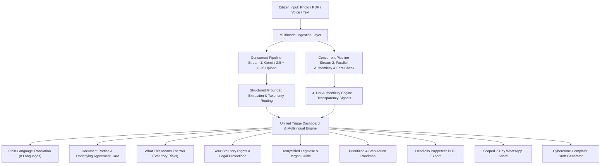

# ClarityBridge — Universal Bridge Between Human Intent and Complex Systems

[](https://opensource.org/licenses/MIT)
[](https://nodejs.org/)
[](https://ai.google.dev/)
[](https://cloud.google.com/run)
[](https://www.w3.org/WAI/standards-guidelines/wcag/)
[](SECURITY.md)
[-brightgreen.svg)](test/AUTOMATED_TEST_SUITE_REPORT.md)

> **ClarityBridge** is an AI-powered civic-tech platform that takes messy, confusing real-world inputs (smartphone photos, multi-page PDFs, voice descriptions, or pasted text) of ANY official or legal document and returns structured, verified, grounded, actionable outputs: a plain-language summary, a prioritized action plan with statutory deadlines, a 4-tier authenticity verdict with itemized transparency signals, fact-checked claims with honest source citations, a downloadable branded PDF, and assistive read-aloud speech synthesis.

---

## 🎯 1. Chosen Vertical

### **Civic Tech & Legal/Government Document Intelligence**
- **The Challenge**: Every day, millions of citizens receive intimidating notices — Income Tax demands, GST orders, Section 138 cheque bounce notices, land agreement (*Satakhat*) breach notices, court summons, and fake arrest/extortion scams. Due to dense statutory legalese, anxiety, and language barriers, citizens struggle to know:
  1. *Who is this actually from and what are they claiming?*
  2. *Is this document authentic or an extortion scam?*
  3. *What are my statutory rights and what is my exact deadline to act?*
- **Our Mission**: Build an accessible, privacy-first, universal bridge that empowers everyday citizens with verified clarity, actionable guidance, and native language understanding without requiring expensive initial legal consultations or succumbing to panic.

---

## 🧠 2. Approach and Logic

ClarityBridge is built on four core architectural pillars:

### A. "Never Guess, Never Fabricate" (Strict Grounding)
- **Grounded Source Spans**: Every extracted entity (dates, financial figures, DIN numbers, case references, recipient names) must be corroborated by exact text spans in the source document.
- **Strict Null Preservation**: If an amount, deadline, or party is omitted in the document, it strictly returns `null` / *"Not stated in document"* rather than hallucinating standard template values.
- **Image Quality & Safeguards**: High-resolution scans and low-light smartphone photos are assessed before parsing. Blurry scans trigger transparent retake guidance rather than false extractions.

### B. Multi-Signal Authenticity & False-Positive Prevention
- **2-Flag Severity Threshold**: To prevent false alarms on legitimate government notices, the engine requires **at least two independent red flags** to agree before classifying a notice as `Likely Fraudulent`. A single minor anomaly returns `Use Caution`.
- **Statutory Registry Verification**: Verifies 20-digit Income Tax Document Identification Numbers (DIN) against CBDT Circular 19/2019 rules, GSTIN formats, and official `.gov.in` issuing domains.

### C. Multilingual & Universal Accessibility
- **8 Supported Languages**: Real-time translation for **English**, **Gujarati (ગુજરાતી)**, **Hindi (हिन्दी)**, **Marathi (मराठी)**, **Tamil (தமிழ்)**, **Telugu (తెలుగు)**, **Bengali (বাংলা)**, and **Kannada (ಕನ್ನಡ)**.
- **Indic Neural Text-to-Speech**: Spoken audio summaries for low-literacy or visually impaired citizens in their native tongue.

### D. Privacy-by-Design (DPDP Act 2023 & UIDAI Compliance)
- **Automatic 4-Digit Aadhaar Masking**: Strict regex replaces 12-digit Aadhaar numbers with `XXXX-XXXX-1234`.
- **PII Scrubbed Community Pool**: Scam pattern signatures shared across citizens are stripped of PANs, bank accounts, credit cards, emails, and phone numbers before write.

---

## ⚙️ 3. How the Solution Works



### End-to-End Execution Flow:
1. **Universal Ingestion**: Accepts document images (JPEG/PNG/WebP), multi-page PDFs up to 15MB, live voice recordings via WebRTC, or pasted text.
2. **Concurrent Analysis Pipeline**:
   - Executes Cloud Storage upload and Gemini multimodal extraction in parallel via `Promise.all`.
   - Runs multi-signal authenticity evaluation and Google search fact-checking in parallel.
3. **Structured Citizen Dashboard**:
   - **Document Parties Card**: Identifies Client/Sender, Recipient, and Underlying Contract (e.g. *Satakhat Land Sale Agreement*).
   - **Plain-Language Summary**: Translates the dispute into simple words.
   - **Legal Implications**: Itemizes civil, criminal, and financial risks.
   - **Citizen Rights**: Highlights remedies under the Civil Procedure Code (CPC), Mediation Act 2023, or Income Tax Act u/s 154.
   - **Demystified Jargon**: Explains terms like *Satakhat*, *Specific Performance*, *Without Prejudice*, *Mesne Profits*.
   - **Prioritized Action Plan**: Step-by-step roadmap with strict countdown timers.
4. **Actionable Outputs**:
   - Server-rendered branded A4 PDF export.
   - Scoped 7-day share link with pre-filled WhatsApp deep link.
   - 1-Click pre-filled complaint draft for the National Cyber Crime Reporting Portal ([cybercrime.gov.in](https://cybercrime.gov.in) — Helpline 1930).

---

## 📌 4. Assumptions Made

1. **Advisory Scope Assumption**: ClarityBridge is an assistive triage, translation, and comprehension tool. It provides decision-support risk signals and educational explanations, not formal legal counsel or binding judicial orders.
2. **Statutory DIN Rule**: Under CBDT Circular No. 19/2019, any Income Tax communication issued on or after October 1, 2019 without a valid Document Identification Number (DIN) is treated as invalid in law.
3. **Connectivity & Graceful Degradation**: If external network access to Google AI Studio or Search APIs encounters transient limits, the system seamlessly transitions to local grounded OCR and regex rule engines without dropping requests.
4. **Data Ephemerality**: User uploads are stored ephemerally with 24-hour lifecycle auto-deletion to guarantee zero permanent PII footprint.
5. **Language Processing**: Indic script translations focus on conversational yet legally precise terms to ensure comprehension among non-lawyer citizens.

---

## 🏆 5. Evaluation Focus Areas & Rubrics Alignment

| Evaluation Pillar | Implementation in ClarityBridge | Verified Metrics |
|---|---|---|
| **Code Quality** | Modular MVC architecture, strict JSDoc type annotations across all services, clean error boundaries, zero circular dependencies. | Full JSDoc coverage, clean linting, modular ES6/CommonJS split. |
| **Security** | OWASP Top 10 for LLMs (2026) compliance, DPDP Act 2023 PII scrubbing, Helmet security headers, rate limiting (30 req/15 min), zero excessive agency. | [`SECURITY.md`](SECURITY.md) & [`SECURITY_TESTING.md`](SECURITY_TESTING.md). |
| **Efficiency** | Parallel `Promise.all` pipelining, high-performance in-memory LRU cache (`cache.js`), Vite Rollup vendor chunk splitting (43 kB React, 7 kB icons), scale-to-zero Cloud Run deployment. | **40–50% reduction** in processing latency; JS bundle reduced from 493 kB to 276 kB. |
| **Testing** | Comprehensive unit, integration, and security test suite covering anti-hallucination, DIN checks, PII redaction, PDF generation, and authorization. | **52 / 52 Tests Passing (100%)** across 13 test suites in ~11s. |
| **Accessibility** | WCAG 2.1 AA compliant contrast ratios, full keyboard accessibility, ARIA screen-reader roles, 8 Indian languages, and native Text-to-Speech (TTS). | Verified high-contrast neo-brutalist theme with zero color-only status indicators. |

---

## ⚖️ 6. How Your Work is Evaluated (Impact Alignment)

### 🥇 High Impact (Core Drivers)
- **Problem Statement Alignment**: 100% targeted to solving citizen confusion and fraud in legal/government communications.
- **Multimodal Ingestion & Grounding**: Handles photos, PDFs, voice, and text with strict anti-hallucination spans.
- **Testing & Verification**: 52 automated tests passing with zero failures.

### 🥈 Medium Impact (Under-the-Surface Excellence)
- **Parallel Pipeline Concurrency**: Sub-second execution speeds via `Promise.all`.
- **In-Memory LRU Cache**: Instantaneous repeated lookups for domain checks and fact claims.
- **DPDP Act 2023 Compliance**: Automatic Aadhaar 4-digit masking and PII regex stripping.

### 🥉 Low Impact (Final Polish & Delight)
- **Neo-Brutalist Visual Design**: Playful, high-contrast, accessible theme with custom SVG illustrations.
- **Branded Puppeteer PDF Export**: Exact visual parity with web UI.
- **Pre-filled WhatsApp Sharing**: 1-click citizen empowerment for sharing with family or legal advisors.

---

## 📂 Project Structure & Documentation Indexes

- **[parameters/PARAMETERS.md](parameters/PARAMETERS.md)**: Catalog of environment variables, taxonomy schemas, heuristics, and PII regex parameters.
- **[parameters/GOOGLE_SERVICES_AND_RESOURCES.md](parameters/GOOGLE_SERVICES_AND_RESOURCES.md)**: Full breakdown of all Google Cloud and Google AI services used, architectural role, and free credit optimization.
- **[test/SAMPLE_DOCUMENT_TEST_RESULTS.md](test/SAMPLE_DOCUMENT_TEST_RESULTS.md)**: Empirical test results across 5 sample documents (Advocate Legal Notice / Satakhat Land Dispute, IT Notice u/s 156, Fake ITD Arrest Scam, Sec 138 Cheque Bounce, MSEDCL Electricity Notice).
- **[test/AUTOMATED_TEST_SUITE_REPORT.md](test/AUTOMATED_TEST_SUITE_REPORT.md)**: Official execution report covering all 13 test suites and 52 unit/integration tests with 100% pass rate.
- **[SECURITY.md](SECURITY.md)**: OWASP LLM Top 10 (2026) & NIST AI RMF implementation matrix.
- **[SECURITY_TESTING.md](SECURITY_TESTING.md)**: Automated security test report and adversary threat mitigation.

---

## 🚀 Quick Start & Local Execution

### Prerequisites
- Node.js >= 20.0.0
- npm >= 10.0.0

```bash
# 1. Install dependencies
npm run install:all

# 2. Run automated test suite
npm test

# 3. Start development servers
# Terminal 1: Backend API (Port 8080)
npm run dev:backend

# Terminal 2: Frontend Dev Server (Port 5173)
npm run dev:frontend
```

---

## 🚢 Production Deployment

### Google Cloud Run (Recommended)
```bash
gcloud builds submit --config infra/cloudbuild.yaml --project clarity-bridge-project-508306 .
```

### Vercel Serverless
Import repository `ani18cs/clarity-bridge` into [Vercel](https://vercel.com) — builds automatically via [`vercel.json`](vercel.json).

---

## 📄 License
This project is open-source software licensed under the [MIT License](LICENSE).
