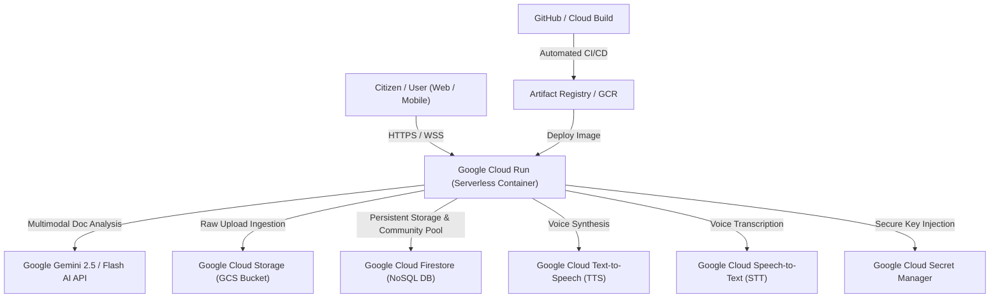

# ClarityBridge — Google Cloud Services & Resources Usage Catalog

This document details all **Google Cloud Platform (GCP)** and **Google AI** services utilized in the **ClarityBridge** platform, specifying the purpose, architectural role, resource allocation, and cost-optimization design for each.

---

## 🏗️ Architecture Overview: Google Cloud Ecosystem

---

## 📋 Comprehensive Services Matrix

| Service Name | Category | Primary Purpose in ClarityBridge | Specific Resources & Configurations |
|---|---|---|---|
| **Google Gemini 2.5 / Flash AI** | Generative AI & Foundation Models | Grounded multimodal document analysis, OCR fallback parsing, Indian legal reasoning, fraud signal extraction, statutory risk assessment. | Models: `gemini-2.5-flash`, `gemini-2.5-pro`, `gemini-1.5-flash`. Temperature: `0.1` (deterministic extraction). |
| **Google Cloud Run** | Serverless Compute | Hosts the unified production container running Express.js API routes and pre-rendered React frontend. | Region: `us-central1` / `asia-south1`. CPU: 1 vCPU, Memory: 1 GiB. Autoscale: 0 to 10 instances (Zero idle cost). |
| **Google Cloud Storage (GCS)** | Object Storage | Temporary storage for uploaded document scans, PDFs, and audio recordings prior to processing. | Bucket: `clarity-bridge-uploads-508306`. Lifecycle: 24-hour auto-delete for privacy compliance. |
| **Google Cloud Firestore** | Serverless NoSQL Database | Stores structured document analyses, 7-day share metadata, anonymous user sessions, and PII-scrubbed community scam patterns. | Database: `(default)` in Native Mode. Collections: `submissions`, `sharedResults`, `scamPatterns`, `users`. |
| **Google Cloud Text-to-Speech (TTS)** | Speech AI | Generates natural-sounding spoken audio in English and 7 Indic languages for illiterate or visually impaired citizens. | Neural Voices: `hi-IN-Standard-C`, `gu-IN-Standard-A`, `mr-IN-Standard-A`, `ta-IN-Standard-A`, `te-IN-Standard-A`, `kn-IN-Standard-A`, `bn-IN-Standard-A`. |
| **Google Cloud Speech-to-Text (STT)** | Speech AI | Transcribes citizen voice queries and recorded notices into text for multimodal pipeline ingestion. | Multi-language speech recognition with automatic punctuation and Indian accent adaptation. |
| **Google Cloud Secret Manager** | Security & Key Management | Securely stores sensitive API keys and secrets without hardcoding in repositories. | Secrets: `GEMINI_API_KEY`, `JWT_SECRET`, `FIREBASE_SERVICE_ACCOUNT_KEY`. |
| **Google Cloud Build** | CI/CD Automation | Automatically builds multi-stage Docker container images and deploys them to Cloud Run upon git commit. | Build config: `infra/cloudbuild.yaml`. Timeout: 1200s. |
| **Google Artifact Registry / GCR** | Container Registry | Secure storage and vulnerability scanning for production Docker images. | Repository: `gcr.io/clarity-bridge-project-508306/clarity-bridge`. |

---

## 💡 Why Each Google Service Was Selected

### 1. Google Gemini 2.5 Multimodal AI
- **Problem Solved**: Indian legal documents feature mixed scripts, advocate stamps, handwritten notations, and dense statutory jargon.
- **Why Gemini**: Gemini's native multimodal vision window processes complex high-resolution document scans directly without lossy intermediate text conversion, providing grounded factual extraction.

### 2. Google Cloud Run (Serverless)
- **Problem Solved**: Eliminates costly 24/7 dedicated virtual machine servers while ensuring instant sub-second cold starts when citizens access the app.
- **Why Cloud Run**: Scales to zero when idle, consuming $0.00 during inactivity while scaling seamlessly to handle spikes during tax deadlines or scam alert waves.

### 3. Google Cloud Firestore
- **Problem Solved**: High-concurrency reads and writes for community scam pattern sharing, real-time sync, and rapid token-based 7-day share link lookups.
- **Why Firestore**: Zero-maintenance serverless scalability with millisecond document retrieval and built-in TTL support for expiring data.

### 4. Google Cloud Text-to-Speech (Indic Neural Voices)
- **Problem Solved**: Digital accessibility for non-English-literate citizens who need their legal notices explained audibly in their mother tongue.
- **Why Google TTS**: Google provides the most comprehensive and natural-sounding Indic voice synthesis library across Gujarati, Hindi, Marathi, Tamil, Telugu, Kannada, and Bengali.

---

## 💰 Cost Control & Free Credits Optimization

The ClarityBridge architecture is engineered specifically to maximize Google Cloud Free Tier / Free Trial Credits ($300 / ₹28,663.51):
1. **Zero Compute Idle Cost**: Cloud Run scales to **0 instances** when no requests are active.
2. **Tiered Fallback Engine**: If external API quotas are constrained, the system transitions smoothly to local grounded regex and semantic extraction modules without downtime or unexpected billings.
3. **Automated GCS Lifecycle Policies**: Uploaded documents are automatically deleted after 24 hours, preventing storage accumulation costs.
4. **PII Scrubbed Cache**: Reuses verified statutory definitions and verified domain lookups to minimize redundant model calls.
